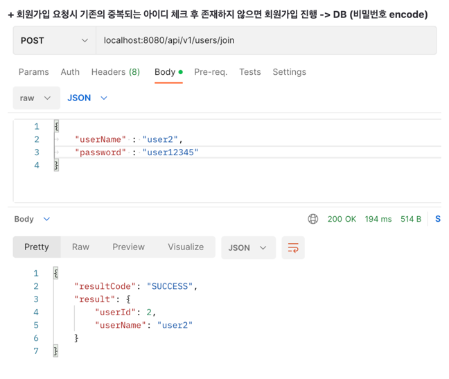
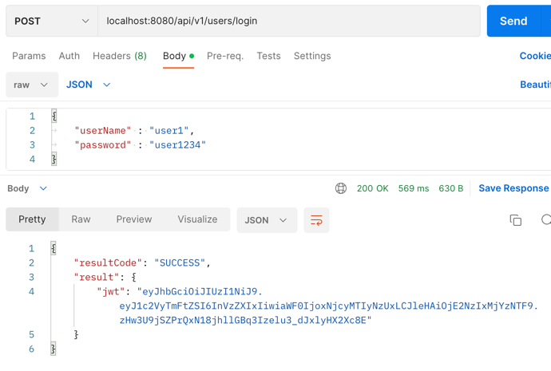
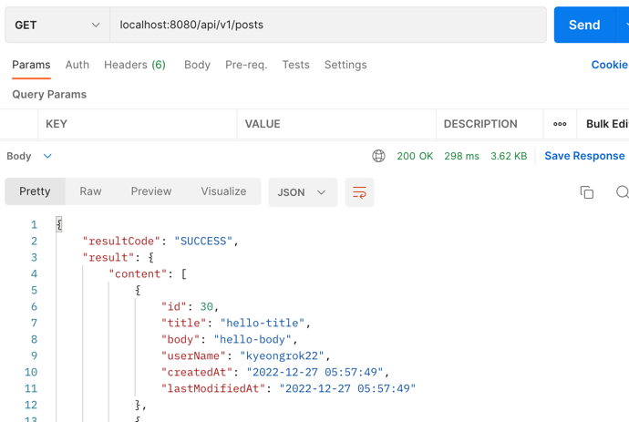
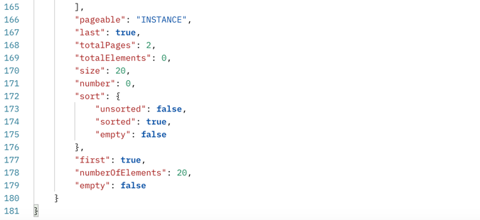
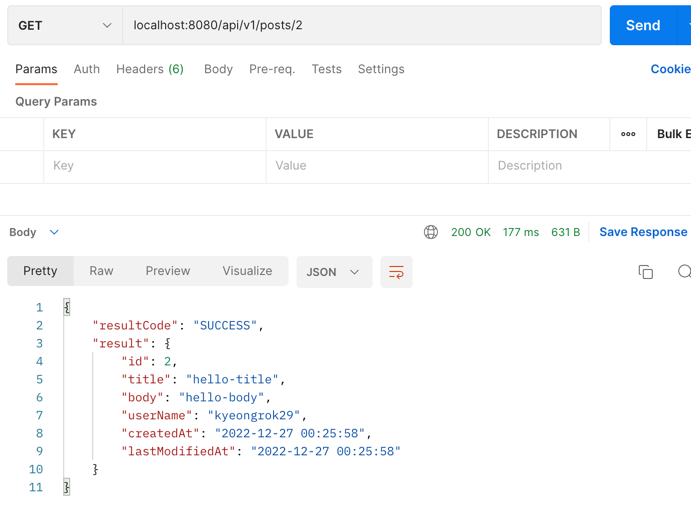
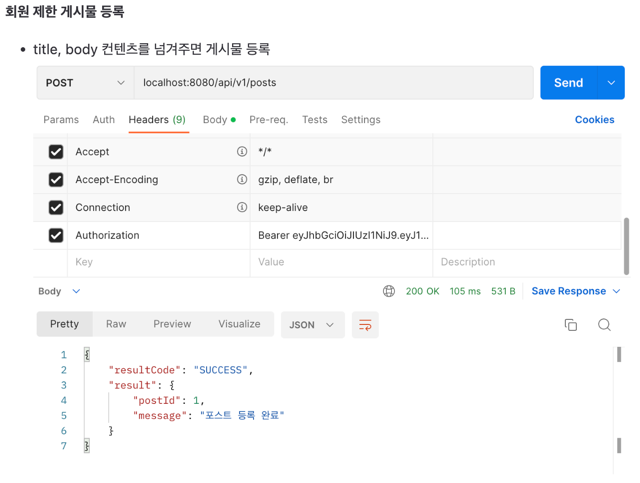
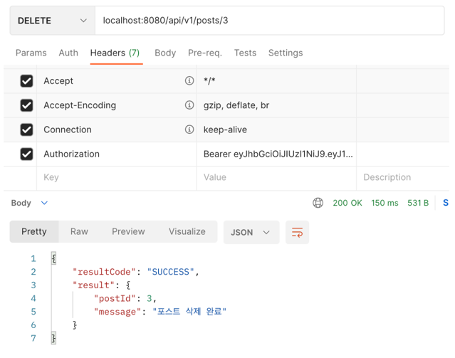
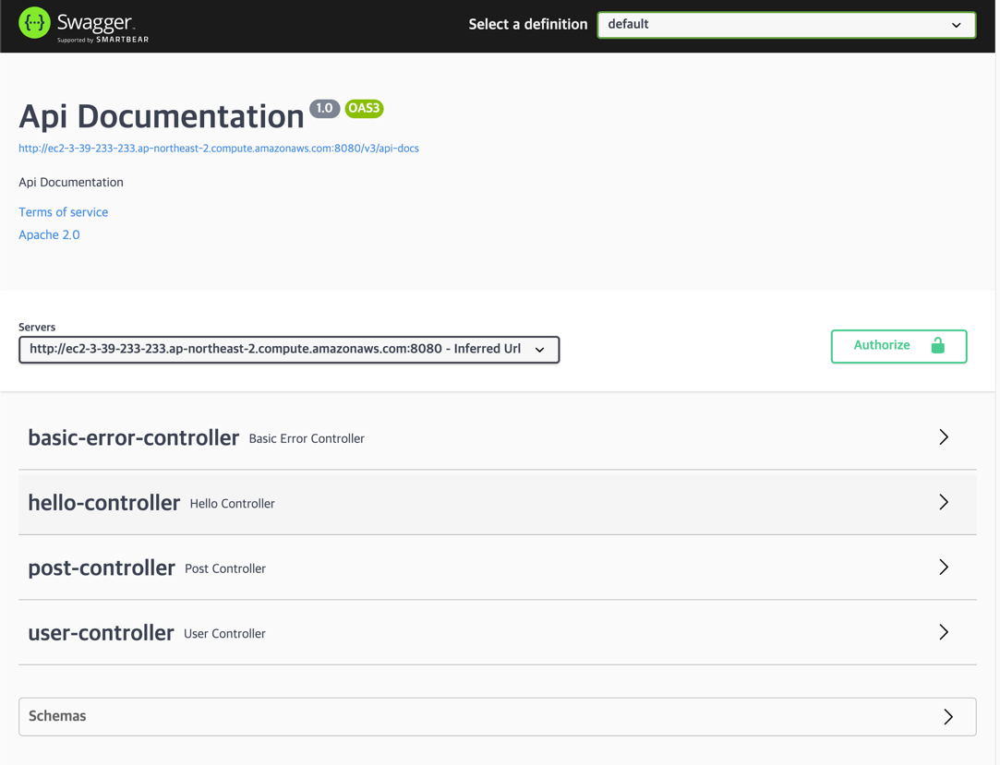
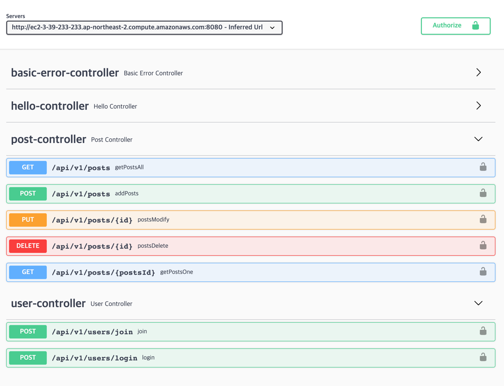

# 📌 Likelion 개인 프로젝트

## 
🟧BackEnd 
- Language/Skills : JAVA11, JPA, JWT, Spring Security  
- Framework : Springboot 2.7.5 
- DB: Mysql 
- Build tool: Gradle 
- 배포: AWS ubuntu 

🟧 CI / CD: gitlab, crontab  
🟧 API 문서: Swagger UI  

## 구현기능 체크리스트
☑️ 인증/인가 필터 구현 
☑️ 게시글 조회 / 수정 / 삭제 API 구현 
☑️ 회원가입 테스트 코드 작성 
☑️ Swagger를 이용하여 게시글 API 문서 자동화 
☑️ develop 브랜치에 push 할 경우 project-lion-api 애플리케이션 AWS EC2 서버에 자동으로 배포 되도록 구현 

[구현중 학습한 내용] 
- stream: 스트림 체인 메서드 및 사용 방법 학습 
- lambda: 람다 형태
- 정적 팩토리 패턴에 대하여 공부: 메서드명, 사용하는 이유
- spring security
### 1차 미션
- 배포 주소: [swagger 링크](http://ec2-3-39-233-233.ap-northeast-2.compute.amazonaws.com:8080/swagger-ui/)
- Swagger에서 Jwt Token으로 테스트: [링크](https://velog.io/@may_yun/swagger-JWT-%EC%9D%B8%EC%A6%9D%EC%9D%B8%EA%B0%80-%EC%9A%94%EC%B2%AD)
#### User 
  ☑️ 회원가입 
  🔗 EndPoint: POST /api/v1/users/join  

  회원 인증,인가 - 회원가입 구현 완료 
  회원 가입 요청 아이디 중복 체크 후 저장하는 로직 
  springSecurity 회원가입 
  password encode -> DB 저장 
  
  

  ☑️ 로그인 
  🔗EndPoint: POST /api/v1/users/login  

  로그인 요청시 아이디, 비밀번호 체크 후 일치하면 Token값 반환  
  
  
  

  
#### Post(CRUD) 공통 기능 Auditing 적용
: 게시글 작성, 조회(단건 상세조회, 전체 paging), 수정, 삭제  

  ☑️ 전체 조회(페이징) 
  🔗 EndPoint: GET /api/v1/posts  

  
  

  

  ☑️ 게시글 상세조회 
  🔗 EndPoint: GET /api/v1/posts/{postsId}  
  

  

  ☑️ 게시글 작성 
  🔗 EndPoint: POST /api/v1/posts  
  Authentication 회원 제한 게시물 등록 접근 가능 
  Entity<->DTO 변환: PostsCreateFactory 
  

  

  ☑️ 게시글 삭제 
  🔗 EndPoint: DELETE /api/v1/posts  
  작성자와 삭제 요청자(로그인 유저) 일치 체크 후 삭제 
  

  

  ☑️ 게시글 수정 
  🔗 EndPoint: PUT /api/v1/posts/{postsId}  
  작성자와 수정 요청자(로그인 유저) 일치 체크 후 삭제 
  update query
  

### swagger

